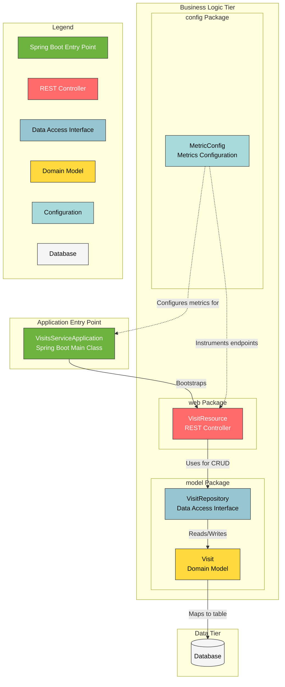
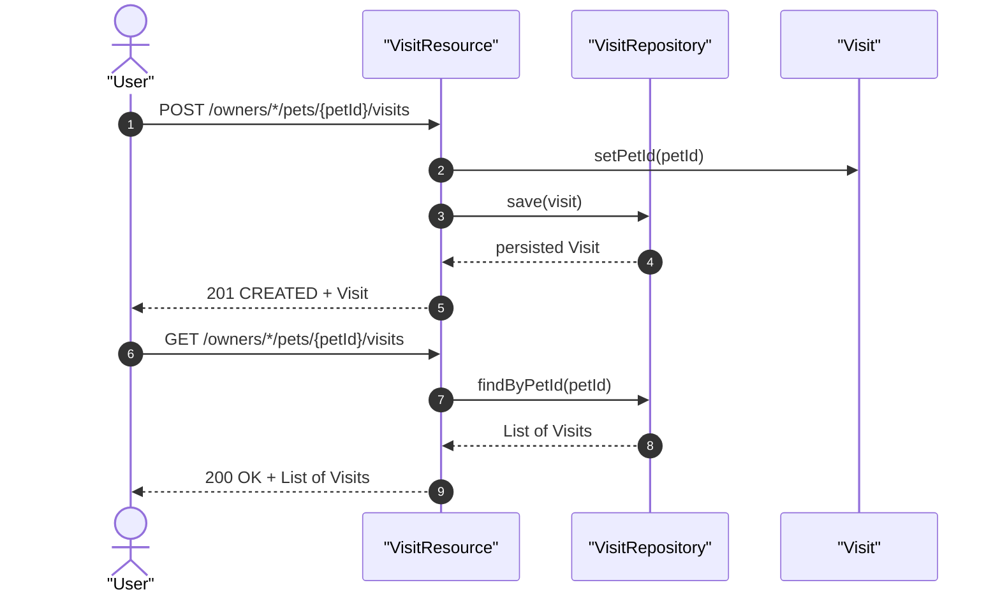

# Visits Service Architecture

Microservices component for managing veterinary visit records in the Pet Clinic application.


The Visits Service is a Spring Boot microservice that provides REST API endpoints for creating and retrieving veterinary visit records associated with pets. It uses Spring Data JPA for persistence and integrates with Spring Cloud for service discovery. The service also includes Micrometer-based metrics configuration for application observability.

## Overview

The Visits Service is one of several microservices composing the Pet Clinic project. Its primary responsibility is managing visit data — records of veterinary appointments linked to specific pets. Each visit stores a date, a description (limited to 8192 characters), and the ID of the associated pet.

The service operates alongside the following sibling repositories within the Pet Clinic microservices architecture:

- **petclinic-customers-service**
- **petclinic-vets-service**
- **petclinic-api-gateway**



The application entry point is `VisitsServiceApplication`, which bootstraps Spring Boot auto-configuration and registers with a service discovery server. The core packages are organized as follows:

| Package | Purpose |
|---------|---------|
| `model` | Contains the `Visit` entity, `VisitBuilder`, and `VisitRepository` interface |
| `web` | Contains the `VisitResource` REST controller and its test |
| `config` | Contains `MetricConfig` for Micrometer metrics setup |

## Features

- **REST API** — Exposes HTTP endpoints for creating and retrieving visit records associated with pets
- **JPA Persistence** — Uses Spring Data JPA with a `VisitRepository` interface extending `JpaRepository` for database operations
- **Visit Entity Model** — Defines a `Visit` entity with fields for ID, date, pet ID, and description (with a max length constraint of 8192 characters)
- **Builder Pattern** — Provides a `VisitBuilder` class with a fluent API for constructing `Visit` objects via a static `aVisit()` factory method
- **Service Discovery** — Integrates with Spring Cloud service discovery via `@EnableDiscoveryClient` for automatic registration
- **Micrometer Metrics** — Configures application-wide metrics using Micrometer with common tags (e.g., `application=petclinic`) and `@Timed` annotations on controller methods
- **Test Suite** — Includes test coverage for REST API endpoints via `VisitResourceTest` using the Spring MVC test framework

## Requirements

- Java (version required by the project's Maven configuration)
- Apache Maven
- A Spring Cloud-compatible service discovery server (e.g., Eureka) for runtime registration
- A relational database compatible with Spring Data JPA

## Installation

### Prerequisites

Verify that Java and Maven are installed:

```bash
java -version
mvn -version
```

### Build the Service

Clone the repository and build the project:

```bash
git clone https://github.com/audoclyphia-evals/petclinic-visits-service.git
cd petclinic-visits-service
mvn clean package
```

To skip tests during the build:

```bash
mvn clean package -DskipTests
```

## Quick Start

1. Build the project:

```bash
mvn clean package
```

2. Start the service:

```bash
mvn spring-boot:run
```

3. Create a visit for a pet:

```bash
curl -X POST http://localhost:8080/owners/1/pets/1/visits \
  -H "Content-Type: application/json" \
  -d '{"date":"2024-01-15","description":"Annual checkup"}'
```

4. Retrieve visits for a pet:

```bash
curl http://localhost:8080/owners/1/pets/1/visits
```

## Usage

### Create a Visit

The `POST /owners/*/pets/{petId}/visits` endpoint creates a new visit record. The `petId` is extracted from the URL path and assigned to the visit before persisting.

```bash
curl -X POST http://localhost:8080/owners/1/pets/1/visits \
  -H "Content-Type: application/json" \
  -d '{"date":"2024-01-15","description":"Annual checkup"}'
```

Returns the persisted `Visit` object with HTTP status 201 Created.

### Retrieve Visits for a Single Pet

The `GET /owners/*/pets/{petId}/visits` endpoint returns all visits associated with a specific pet.

```bash
curl http://localhost:8080/owners/1/pets/1/visits
```

Returns a JSON array of `Visit` objects.

### Retrieve Visits for Multiple Pets

The `GET /pets/visits` endpoint accepts multiple pet IDs as query parameters and returns visits for all specified pets.

```bash
curl "http://localhost:8080/pets/visits?petId=1&petId=2"
```

Returns a `Visits` wrapper object containing an `items` list of `Visit` objects.



### Using the VisitBuilder

The `VisitBuilder` provides a fluent API for constructing `Visit` objects programmatically:

```java
import org.springframework.samples.petclinic.visits.model.Visit;

Visit visit = Visit.VisitBuilder.aVisit()
    .id(1)
    .petId(1)
    .date(new Date())
    .description("Routine vaccination")
    .build();
```

The builder enforces controlled instantiation through a private constructor and the static `aVisit()` factory method. All properties — `id`, `date`, `petId`, and `description` — are optional and can be set in any order before calling `build()`.