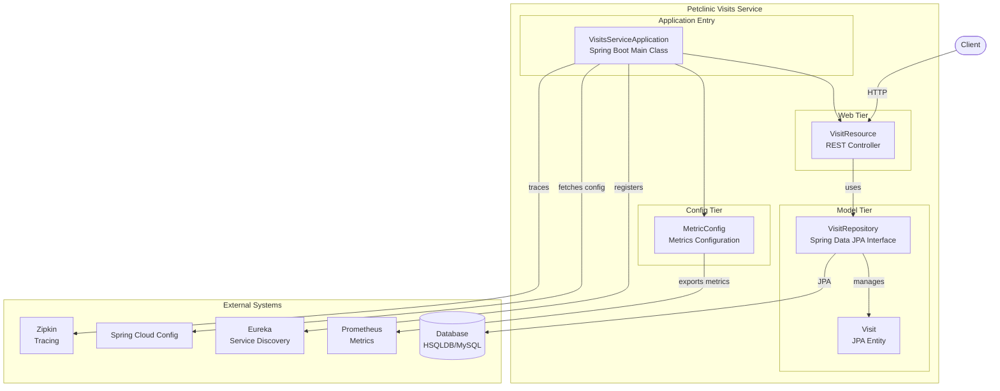
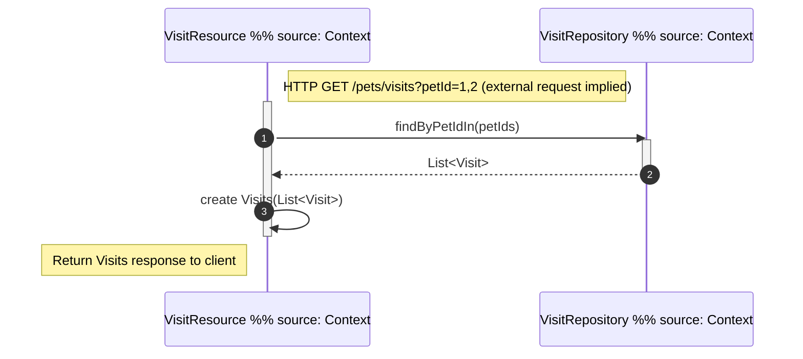
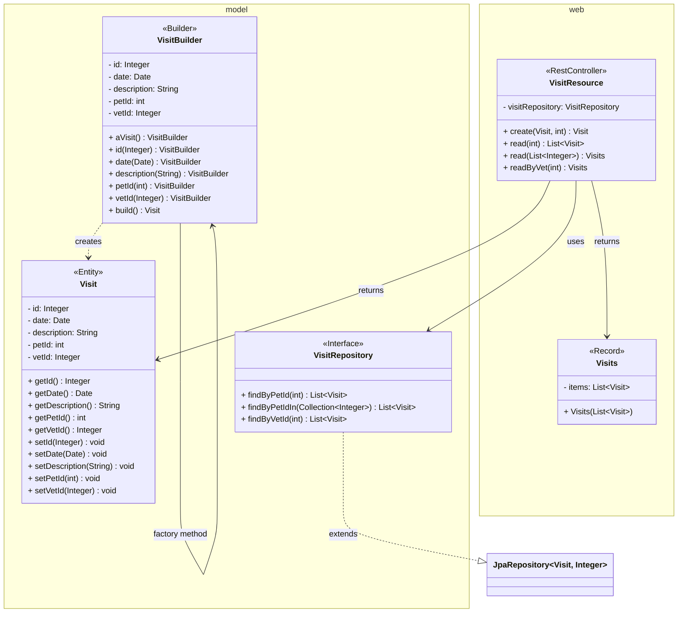

# Architecture Overview

**Microservice responsible for managing veterinary visit records in the Spring PetClinic microservices application.**

The PetClinic Visits Service is a standalone Spring Boot microservice that provides REST endpoints for creating and retrieving pet visit data. It persists visit information using JPA and integrates with the broader PetClinic microservices ecosystem through Netflix Eureka for service discovery, Spring Cloud Config for externalized configuration, and Zipkin for distributed tracing.

---

## Architecture

The service follows a standard layered Spring Boot architecture with three primary layers: the REST web layer, the data access layer, and the domain model layer.



### Components

| Component | Location | Responsibility |
|---|---|---|
| **VisitsServiceApplication** | `visits/` | Application entry point; bootstraps the Spring Boot context with `@SpringBootApplication` and `@EnableDiscoveryClient` |
| **VisitResource** | `visits/web/` | REST controller exposing endpoints for creating and querying visits by pet or vet |
| **Visit** | `visits/model/` | JPA entity mapped to the `visits` table, holding visit metadata (date, description, pet ID, vet ID) |
| **VisitRepository** | `visits/model/` | Spring Data JPA repository interface providing persistence operations for `Visit` entities |
| **MetricConfig** | `visits/config/` | Micrometer metrics configuration enabling `@Timed` annotations and applying common tags |

### Interaction Flow



An incoming HTTP request is received by `VisitResource`, which delegates to `VisitRepository` for data access. The repository uses Spring Data JPA to execute queries against the underlying database (HSQLDB for development, MySQL for production). Metrics are collected automatically via the `@Timed("petclinic.visit")` annotation on the controller, backed by the `TimedAspect` bean configured in `MetricConfig`.

### Key Design Decisions

- **Service Discovery**: The application registers with Netflix Eureka via `@EnableDiscoveryClient`, allowing other PetClinic services (API Gateway, Customers Service, Vets Service) to locate it dynamically.
- **Configuration**: Externalized configuration is managed through Spring Cloud Config.
- **Observability**: Distributed tracing is supported via Spring Boot Starter Zipkin. Prometheus metrics are exported through the `micrometer-registry-prometheus` dependency.
- **Resilience**: Chaos Monkey integration is included for fault injection testing in distributed scenarios.

---

## Domain Model

The domain model consists of a single JPA entity and its supporting repository interface.



### Visit Entity

The `Visit` class is a JPA entity mapped to the `visits` table with the following fields:

| Field | Type | Description |
|---|---|---|
| `id` | `Integer` | Primary key (auto-generated) |
| `date` | `Date` | Date of the visit |
| `petId` | `int` | Foreign key reference to the owning pet |
| `vetId` | `Integer` | Foreign key reference to the assigned veterinarian |
| `description` | `String` | Free-text description of the visit |

The entity provides standard getters and setters for all fields, as well as a builder pattern (`VisitBuilder`) for fluent object construction.

### VisitRepository

`VisitRepository` extends `JpaRepository<Visit, Integer>`, inheriting standard CRUD operations. Additional query methods follow Spring Data naming conventions to support lookup by pet ID (`findByPetId`) and vet ID (`findByVetId`).

---

## Directory Structure

```
petclinic-visits-service/
├── src/
│   ├── main/
│   │   └── java/org/springframework/samples/petclinic/visits/
│   │       ├── VisitsServiceApplication.java   # Application entry point
│   │       ├── config/
│   │       │   └── MetricConfig.java           # Micrometer metrics configuration
│   │       ├── model/
│   │       │   ├── Visit.java                  # JPA entity and builder
│   │       │   └── VisitRepository.java        # Spring Data JPA repository
│   │       └── web/
│   │           └── VisitResource.java          # REST controller
│   └── test/
│       └── java/org/springframework/samples/petclinic/visits/
│           └── web/
│               └── VisitResourceTest.java      # Controller unit tests
└── pom.xml                                     # Maven build configuration
```

### Package Descriptions

- **`config`** — Application configuration classes; currently contains Micrometer metrics setup.
- **`model`** — Domain model layer with the `Visit` entity and `VisitRepository` interface.
- **`web`** — REST API layer containing the `VisitResource` controller and its tests.

---

## API

API endpoint details are not available in the current context index.

The `VisitResource` controller exposes endpoints under the `petclinic.visit` timer. Refer to the controller source at `src/main/java/org/springframework/samples/petclinic/visits/web/VisitResource.java` for full endpoint definitions.

---

## Metrics and Observability

The `MetricConfig` class configures Micrometer-based metrics collection:

- **Common Tags**: All meters are tagged with `application=petclinic` for consistent filtering across services.
- **Timed Aspects**: A `TimedAspect` bean enables AOP-based method timing for any `@Timed`-annotated method.
- **Prometheus Export**: The `micrometer-registry-prometheus` dependency exposes a `/actuator/prometheus` endpoint for scraping.

---

## Dependencies

Key runtime dependencies (from `pom.xml`):

| Dependency | Purpose |
|---|---|
| `spring-boot-starter-webmvc` | REST API framework |
| `spring-boot-starter-data-jpa` | JPA persistence with Spring Data |
| `spring-boot-starter-actuator` | Health checks and management endpoints |
| `spring-boot-starter-zipkin` | Distributed tracing |
| `spring-cloud-starter-config` | Externalized configuration |
| `spring-cloud-starter-netflix-eureka-client` | Service discovery registration |
| `hsqldb` | In-memory database for development |
| `mysql-connector-j` | MySQL driver for production |
| `micrometer-registry-prometheus` | Prometheus metrics export |
| `chaos-monkey-spring-boot` | Fault injection for resilience testing |
| `datasource-micrometer-spring-boot` | Datasource-level observability |

---

## Contributing

For development practices, testing procedures, and contribution workflows, refer to the [Contributing Guidelines](CONTRIBUTING.md).