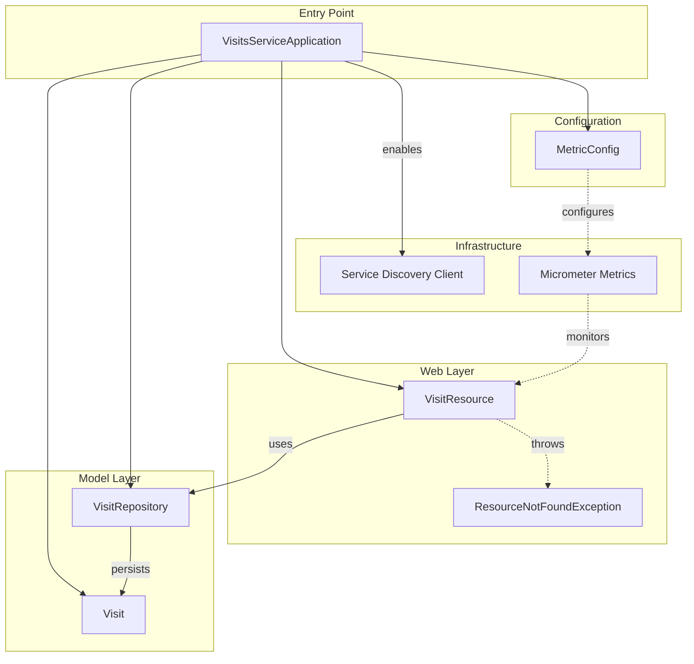
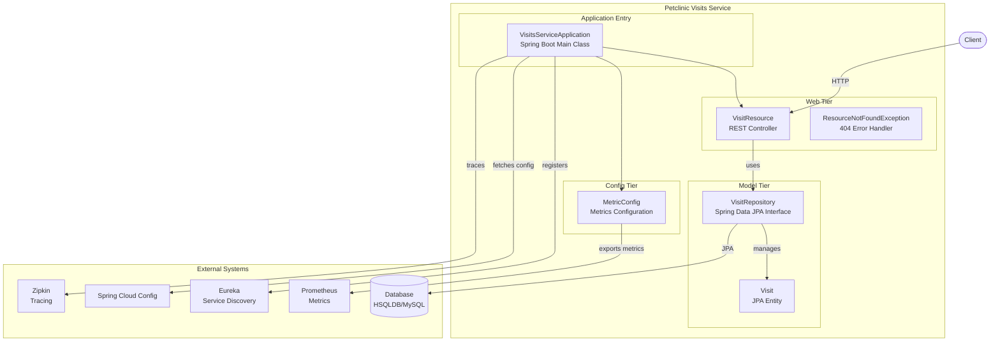
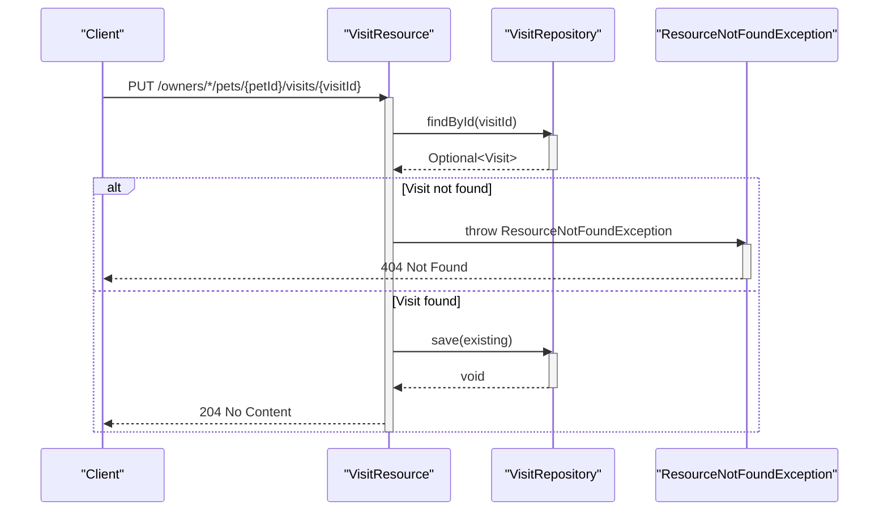
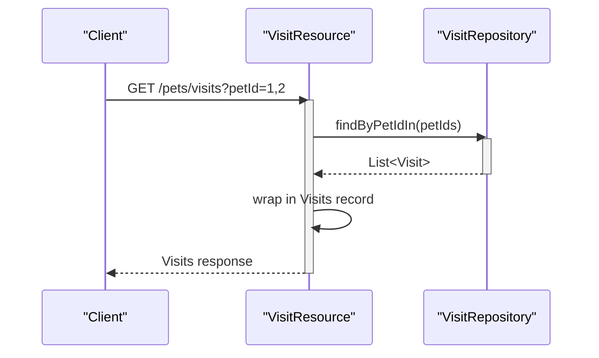

# PetClinic Visits Service

**Microservice responsible for managing veterinary visit records in the Spring PetClinic microservices application.**

The PetClinic Visits Service is a standalone Spring Boot microservice that provides REST endpoints for creating, retrieving, updating, and deleting pet visit data. It persists visit information using JPA and integrates with the broader PetClinic microservices ecosystem through Netflix Eureka for service discovery, Spring Cloud Config for externalized configuration, and Zipkin for distributed tracing.

## Architecture

The service follows a standard layered Spring Boot architecture with three primary layers: the REST web layer, the data access layer, and the domain model layer.





| Component | Location | Responsibility |
|---|---|---|
| **VisitsServiceApplication** | `visits/` | Application entry point; bootstraps the Spring Boot context with `@SpringBootApplication` and `@EnableDiscoveryClient` |
| **VisitResource** | `visits/web/` | REST controller exposing endpoints for creating, reading, updating, and deleting visits by pet or vet |
| **ResourceNotFoundException** | `visits/web/` | Custom exception annotated with `@ResponseStatus(NOT_FOUND)` for signaling missing resources in the API |
| **Visit** | `visits/model/` | JPA entity mapped to the `visits` table, holding visit metadata (date, description, pet ID, vet ID) |
| **VisitBuilder** | `visits/model/` | Fluent builder for constructing `Visit` objects using the Builder design pattern |
| **VisitRepository** | `visits/model/` | Spring Data JPA repository interface providing persistence operations for `Visit` entities |
| **MetricConfig** | `visits/config/` | Micrometer metrics configuration enabling `@Timed` annotations and applying common tags |

An incoming HTTP request is received by `VisitResource`, which delegates to `VisitRepository` for data access. The repository uses Spring Data JPA to execute queries against the underlying database (HSQLDB for development, MySQL for production). For update and delete operations, the controller first locates the existing `Visit` entity by ID, throwing `ResourceNotFoundException` if not found. Metrics are collected automatically via the `@Timed("petclinic.visit")` annotation on the controller, backed by the `TimedAspect` bean configured in `MetricConfig`.

- **Service Discovery**: The application registers with Netflix Eureka via `@EnableDiscoveryClient`, allowing other PetClinic services to locate it dynamically.
- **Configuration**: Externalized configuration is managed through Spring Cloud Config.
- **Observability**: Prometheus metrics are exported through the `micrometer-registry-prometheus` dependency. Distributed tracing is available via Spring Boot Starter Zipkin.
- **Resilience**: Chaos Monkey integration is included for fault injection testing in distributed scenarios.
- **Error Handling**: `ResourceNotFoundException` provides a consistent 404 response when update or delete operations reference non-existent visit records.





### Domain Model

The `Visit` class is a JPA entity mapped to the `visits` table with the following fields:

| Field | Type | Description |
|---|---|---|
| `id` | `Integer` | Primary key (auto-generated) |
| `date` | `Date` | Date of the visit |
| `petId` | `int` | Foreign key reference to the owning pet |
| `vetId` | `Integer` | Foreign key reference to the assigned veterinarian |
| `description` | `String` | Free-text description of the visit (max 8192 characters) |

#### Builder Pattern

The entity implements the Builder design pattern via `VisitBuilder`, providing a fluent API for constructing `Visit` objects:

```java
Visit visit = Visit.aVisit()
    .petId(1)
    .vetId(3)
    .date(new Date())
    .description("Annual checkup")
    .build();
```

The builder exposes setter methods for all fields (`id`, `date`, `description`, `petId`, `vetId`) and a terminal `build()` method that assembles the `Visit` instance.

`VisitRepository` extends `JpaRepository<Visit, Integer>`, inheriting standard CRUD operations. Additional query methods follow Spring Data naming conventions to support lookup by pet ID (`findByPetId`), multiple pet IDs (`findByPetIdIn`), and vet ID (`findByVetId`).

### ResourceNotFoundException

A custom exception class annotated with `@ResponseStatus(HttpStatus.NOT_FOUND)` that extends `RuntimeException`. It is thrown by `VisitResource` when update or delete operations target a visit that does not exist in the repository. The exception carries a descriptive message identifying the missing resource.

## Project Structure

```
petclinic-visits-service/
├── src/
│   ├── main/
│   │   └── java/org/springframework/samples/petclinic/visits/
│   │       ├── VisitsServiceApplication.java   # Application entry point
│   │       ├── config/
│   │       │   └── MetricConfig.java           # Micrometer metrics configuration
│   │       ├── model/
│   │       │   ├── Visit.java                  # JPA entity and builder
│   │       │   └── VisitRepository.java        # Spring Data JPA repository
│   │       └── web/
│   │           ├── VisitResource.java          # REST controller
│   │           └── ResourceNotFoundException.java # 404 error handling
│   └── test/
│       └── java/org/springframework/samples/petclinic/visits/
│           └── web/
│               └── VisitResourceTest.java      # Controller unit tests
└── pom.xml                                     # Maven build configuration
```

- **`config`** — Application configuration classes; currently contains Micrometer metrics setup.
- **`model`** — Domain model layer with the `Visit` entity, `VisitBuilder`, and `VisitRepository` interface.
- **`web`** — REST API layer containing the `VisitResource` controller, `ResourceNotFoundException` for error handling, and their tests.

### API Reference

Full endpoint definitions are documented in `api_documentation.yaml`.

The `VisitResource` controller exposes the following endpoints under the `petclinic.visit` timer:

| Method | Path | Description |
|---|---|---|
| `POST` | `/owners/*/pets/{petId}/visits` | Create a new visit for a pet (returns `201 Created`) |
| `GET` | `/pets/visits?petId={id1},{id2}` | Retrieve visits for one or more pet IDs |
| `GET` | `/vets/{vetId}/visits` | Retrieve all visits assigned to a vet |
| `PUT` | `/owners/*/pets/{petId}/visits/{visitId}` | Update a visit's description and/or date (returns `204 No Content`) |
| `DELETE` | `/owners/*/pets/{petId}/visits/{visitId}` | Delete a visit by ID (returns `204 No Content`) |

All path variables accept integer values with a minimum of 1. Update and delete operations throw `ResourceNotFoundException` (HTTP 404) when the specified visit does not exist. The multi-pet read endpoint accepts a comma-separated list of pet IDs via the `petId` query parameter.

### Metrics and Observability

The `MetricConfig` class configures Micrometer-based metrics collection:

- **Common Tags**: All meters are tagged with `application=petclinic` for consistent filtering across services.
- **Timed Aspects**: A `TimedAspect` bean enables AOP-based method timing for any `@Timed`-annotated method.
- **Prometheus Export**: The `micrometer-registry-prometheus` dependency exposes a `/actuator/prometheus` endpoint for scraping.

### Dependencies

Key runtime dependencies (from `pom.xml`):

| Dependency | Purpose |
|---|---|
| `spring-boot-starter-webmvc` | REST API framework |
| `spring-boot-starter-data-jpa` | JPA persistence with Spring Data |
| `spring-boot-starter-actuator` | Health checks and management endpoints |
| `spring-boot-starter-zipkin` | Distributed tracing |
| `spring-cloud-starter-config` | Externalized configuration |
| `spring-cloud-starter-netflix-eureka-client` | Service discovery registration |
| `hsqldb` | In-memory database for development |
| `mysql-connector-j` | MySQL driver for production |
| `micrometer-registry-prometheus` | Prometheus metrics export |
| `chaos-monkey-spring-boot` | Fault injection for resilience testing |
| `datasource-micrometer-spring-boot` | Datasource-level observability |