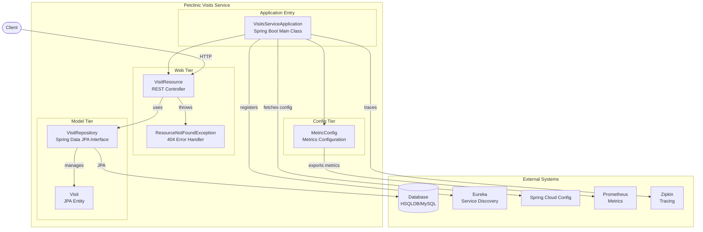
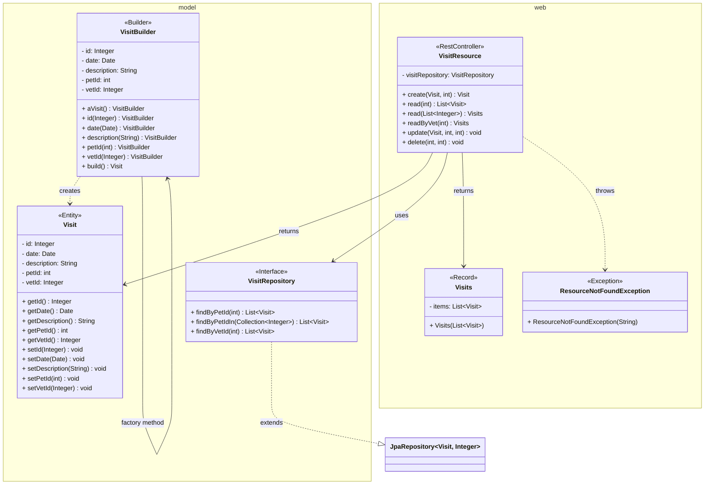
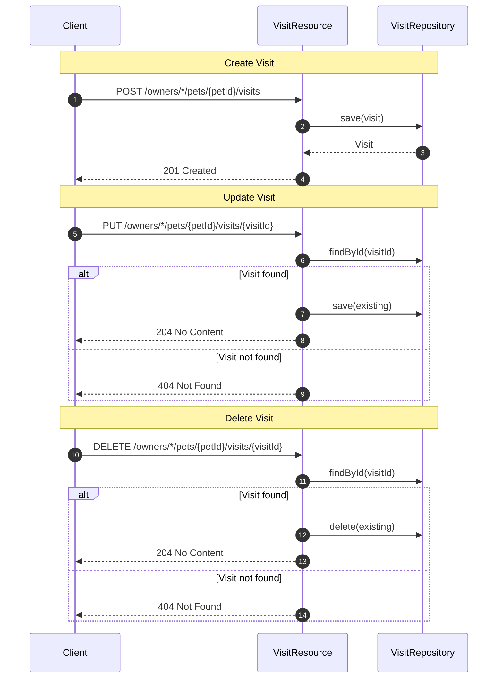

# petclinic-visits-service

Spring PetClinic Visits Service — a microservice for managing pet visit records.


The petclinic-visits-service tracks pet visit records. It exposes a REST API to create and retrieve visits, backed by a JPA repository and a relational database. The service is part of the Spring PetClinic microservices architecture and integrates with Eureka for service discovery, Spring Cloud Config for externalized configuration, and Zipkin for distributed tracing.

*See the [REST API](#rest-api) section for endpoint details, and the [Architecture](#architecture) section for a component diagram overview.*

## Features

- **Visit Management** — Create, retrieve, update, and delete pet visit records via REST endpoints.
- **Spring Data JPA** — Automatic persistence using `JpaRepository` with convention-based query methods.
- **Service Discovery** — Registers with Netflix Eureka for dynamic service discovery.
- **Externalized Configuration** — Integrates with Spring Cloud Config for centralized configuration management.
- **Observability** — Configures Micrometer metrics with Prometheus registry and `@Timed` support for request-level timing. (See the [Metrics](#metrics) subsection in Usage.)
- **Distributed Tracing** — Integrates with Zipkin via Spring Boot Zipkin starter for tracing requests across services.
- **Validation** — Uses Jakarta Bean Validation (`@Valid`, `@Min`, `@Size`) to enforce request constraints.
- **Error Handling** — Returns appropriate HTTP status codes, including 404 for missing resources via `ResourceNotFoundException`.
- **Test Coverage** — Includes unit and integration tests for the REST controller.

## Requirements

Before building or running the service, ensure the following are installed.

### Runtime Dependencies

- **Java** 17 or higher
- **Maven** 3.x (build and dependency management)
- **Docker** (optional, for containerized deployment)

The service requires the following infrastructure at runtime:

- **Relational database** — HSQLDB (default/in-memory) or MySQL (production)
- **Eureka Server** — For service discovery registration
- **Spring Cloud Config Server** — For externalized configuration (optional)
- **Zipkin** — For distributed tracing (optional)

### Development Dependencies

- **JUnit Jupiter** — Test framework (bundled via Spring Boot Test starter)
- **Spring Boot Test** — Integration testing support

## Installation

### Prerequisites

Ensure Java 17+ and Maven 3.x are installed:

```bash
java -version
mvn -version
```

### Build from Source

```bash
# Clone the repository
git clone https://github.com/audoclyphia-evals/petclinic-visits-service.git
cd petclinic-visits-service

# Build the project
mvn clean package
```

### Build Docker Image

The `pom.xml` defines a `buildDocker` Maven profile:

```bash
mvn package -PbuildDocker
```

This builds a Docker image exposed on port **8081**.

## Quick Start

After [installing](#installation) the prerequisites and building the project, follow these steps to run the service.

1. **Build the service**

```bash
mvn clean package
```

2. **Run the service**

```bash
java -jar target/spring-petclinic-visits-service-*.jar
```

3. **Verify the service is running**

```bash
curl http://localhost:8081/owners/*/pets/1/visits
```

The service starts on port **8081** by default and connects to a local HSQLDB instance for the in-memory database.

## Usage

This section covers the service's internal architecture, domain model, REST API endpoints (along with example requests), and metrics configuration.

### Architecture

The service is built with a layered architecture centered around a JPA entity, a repository, and a REST controller. The following components work together:

- **`VisitsServiceApplication`** — Spring Boot entry point with service discovery enabled.
- **`Visit`** — JPA entity representing a visit (fields: `id`, `date`, `petId`, `vetId`, `description`).
- **`VisitRepository`** — Spring Data JPA repository providing CRUD operations and convention-based query methods.
- **`VisitResource`** — REST controller exposing endpoints for creating, retrieving, updating, and deleting visits.
- **`ResourceNotFoundException`** — Custom exception returning HTTP 404 when a requested visit does not exist.
- **`MetricConfig`** — Micrometer metrics configuration for observability.



The domain model centers on the `Visit` JPA entity and its associated repository. The following class diagram summarizes the key domain, web, and error handling classes:



The `Visit` entity maps to the `visits` table with the following fields:

| Field | Type | Description |
|---|---|---|
| `id` | `Integer` | Primary key |
| `date` | `Date` | Date of the visit |
| `petId` | `int` | ID of the pet being visited |
| `vetId` | `Integer` | ID of the vet performing the visit |
| `description` | `String` | Description of the visit |

`ResourceNotFoundException` is a `RuntimeException` annotated with `@ResponseStatus(HttpStatus.NOT_FOUND)`. It is thrown by the `update` and `delete` endpoints when the specified visit ID does not exist, resulting in an automatic HTTP 404 response.

The following sequence diagram illustrates the core request flows for creating, updating, and deleting a visit:



### REST API

The service exposes the following REST endpoints. For the complete OpenAPI specification, see [`api_documentation.yaml`](api_documentation.yaml).

| Method | Path | Description |
|---|---|---|
| `POST` | `/owners/*/pets/{petId}/visits` | Create a new visit record |
| `GET` | `/owners/*/pets/{petId}/visits` | Retrieve visits for a specific pet |
| `GET` | `/pets/visits?petId=1&petId=2` | Retrieve visits for multiple pets |
| `GET` | `/vets/{vetId}/visits` | Retrieve visits for a specific veterinarian |
| `PUT` | `/owners/*/pets/{petId}/visits/{visitId}` | Update a visit's description and/or date |
| `DELETE` | `/owners/*/pets/{petId}/visits/{visitId}` | Delete (cancel) a visit by ID |

#### Create a Visit

```bash
curl -X POST http://localhost:8081/owners/*/pets/1/visits \
  -H "Content-Type: application/json" \
  -d '{
    "date": "2024-01-15T10:30:00",
    "description": "Annual checkup",
    "vetId": 1
  }'
```

Expected response (HTTP 201 Created):

```json
{
  "id": 1,
  "date": "2024-01-15T10:30:00",
  "petId": 1,
  "vetId": 1,
  "description": "Annual checkup"
}
```

#### Retrieve Visits by Pet

```bash
curl http://localhost:8081/owners/*/pets/1/visits
```

Returns a JSON array of `Visit` objects for the specified pet.

#### Retrieve Visits by Vet

```bash
curl http://localhost:8081/vets/1/visits
```

Returns a wrapper object with an `items` field containing the list of visits.

#### Update a Visit

```bash
curl -X PUT http://localhost:8081/owners/*/pets/1/visits/1 \
  -H "Content-Type: application/json" \
  -d '{
    "description": "Updated checkup notes",
    "date": "2024-02-01T14:00:00"
  }'
```

Returns HTTP 204 No Content on success. Returns HTTP 404 if the visit does not exist.

#### Delete a Visit

```bash
curl -X DELETE http://localhost:8081/owners/*/pets/1/visits/1
```

Returns HTTP 204 No Content on success. Returns HTTP 404 if the visit does not exist.

### Metrics

The service exposes Micrometer metrics with a common tag `application=petclinic`. The `VisitResource` controller is annotated with `@Timed("petclinic.visit")`, providing request-level timing via the `TimedAspect` bean configured in `MetricConfig`. Prometheus metrics are available at the Actuator endpoint (requires additional configuration).

## Additional Documentation

- [System Architecture](ARCHITECTURE.md) — Provides a detailed overview of the system's design, layers, and component interactions.
- [Contributing Guidelines](CONTRIBUTING.md) — Outlines development practices, testing procedures, and contribution workflows.

openapi: 3.0.3
info:
  title: API Documentation
  description: Auto-generated API documentation
  version: 1.0.0
paths:
  /vets/{vetId}/visits:
    get:
      summary: Endpoint to read visits by vet ID
      description: Retrieves all visits associated with a specific vet.
      operationId: readByVet
      tags:
      - Visits
      responses:
        '200':
          description: Success - Returns list of visits for the given vet
        '400':
          description: Bad request - Invalid vetId (less than 1)
        '401':
          description: Unauthorized
        '500':
          description: Internal server error
      parameters:
      - name: vetId
        in: path
        required: true
        schema:
          type: integer
        description: Unique identifier of the vet (must be >= 1)
  /owners/*/pets/{petId}/visits/{visitId}:
    delete:
      summary: Delete a visit by ID
      description: Deletes a visit associated with a pet by their IDs.
      operationId: deleteVisit
      tags:
      - Visit
      responses:
        '204':
          description: Visit deleted successfully
        '400':
          description: Invalid ID provided
        '404':
          description: Visit not found
        '500':
          description: Internal server error
      parameters:
      - name: petId
        in: path
        required: true
        schema:
          type: integer
        description: ID of the pet
      - name: visitId
        in: path
        required: true
        schema:
          type: integer
        description: ID of the visit to delete
  /pets/visits:
    get:
      summary: Retrieve visits by pet IDs
      description: Fetches all visit records associated with the provided list of
        pet IDs.
      operationId: getVisitsByPetIds
      tags:
      - Visits
      responses:
        '200':
          description: Success
        '400':
          description: Bad request
        '401':
          description: Unauthorized
        '500':
          description: Internal server error
      parameters:
      - name: petId
        in: query
        required: true
        schema:
          type: array
          items:
            type: integer
        description: List of pet IDs to query
tags:
- name: Visit
- name: Visits