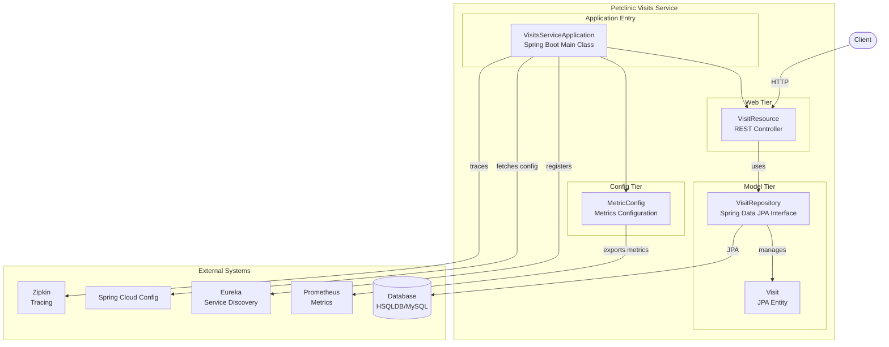
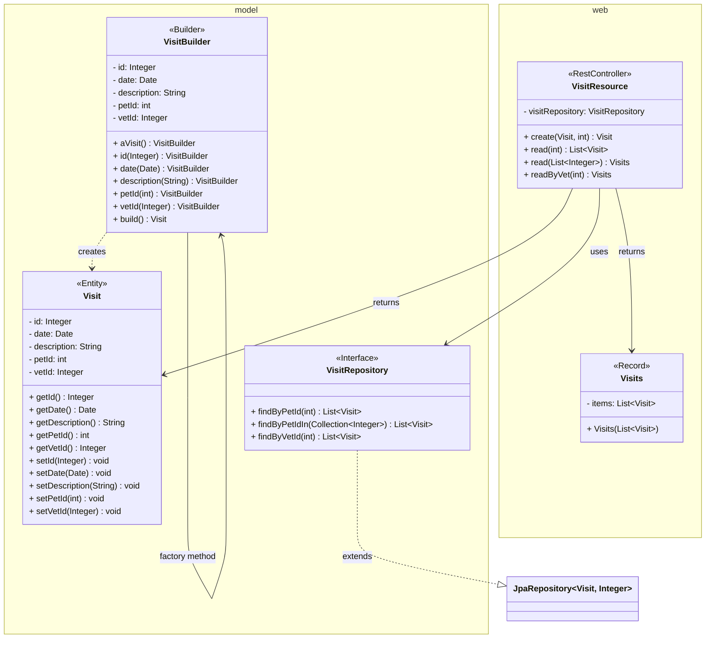
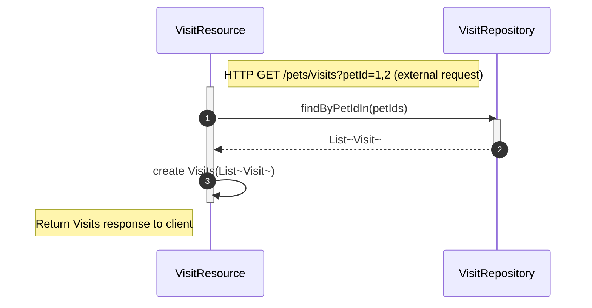

# petclinic-visits-service

Spring PetClinic Visits Service — a microservice for managing pet visit records.


The petclinic-visits-service tracks pet visit records. It exposes a REST API to create and retrieve visits, backed by a JPA repository and a relational database. The service is part of the Spring PetClinic microservices architecture and integrates with Eureka for service discovery, Spring Cloud Config for externalized configuration, and Zipkin for distributed tracing.

*See the [REST API](#rest-api) section for endpoint details, and the [Architecture](#architecture) section for a component diagram overview.*

---

## Project Overview

The service operates as part of a multi-service architecture alongside:

| Service | Repository | Role |
|---|---|---|
| API Gateway | `petclinic-api-gateway` | Routes external requests to backend services |
| Customers Service | `petclinic-customers-service` | Manages owner and pet data |
| Vets Service | `petclinic-vets-service` | Manages veterinarian data |
| **Visits Service** | **`petclinic-visits-service`** | **Manages pet visit records** |

The service's core components are:

- **`Visit`** — JPA entity representing a visit (fields: `id`, `date`, `petId`, `vetId`, `description`).
- **`VisitRepository`** — Spring Data JPA repository providing CRUD operations and convention-based query methods.
- **`VisitResource`** — REST controller exposing endpoints for creating and retrieving visits.
- **`MetricConfig`** — Micrometer metrics configuration for observability.
- **`VisitsServiceApplication`** — Spring Boot entry point with service discovery enabled.

*For a visual overview of these components and their interactions, see the [Architecture](#architecture) section.*

---

## Features

The service provides the following capabilities:

- **Visit Management** — Create and retrieve pet visit records via REST endpoints.
- **Spring Data JPA** — Automatic persistence using `JpaRepository` with convention-based query methods.
- **Service Discovery** — Registers with Netflix Eureka for dynamic service discovery.
- **Externalized Configuration** — Integrates with Spring Cloud Config for centralized configuration management.
- **Observability** — Configures Micrometer metrics with Prometheus registry and `@Timed` support for request-level timing. (See the [Metrics](#metrics) subsection in Usage.)
- **Distributed Tracing** — Integrates with Zipkin via Spring Boot Zipkin starter for tracing requests across services.
- **Validation** — Uses Jakarta Bean Validation (`@Valid`, `@Min`, `@Size`) to enforce request constraints.
- **Test Coverage** — Includes unit and integration tests for the REST controller.

---

## Requirements

Before building or running the service, ensure the following are installed.

### Runtime Dependencies

- **Java** 17 or higher
- **Maven** 3.x (build and dependency management)
- **Docker** (optional, for containerized deployment)

The service requires the following infrastructure at runtime:

- **Relational database** — HSQLDB (default/in-memory) or MySQL (production)
- **Eureka Server** — For service discovery registration
- **Spring Cloud Config Server** — For externalized configuration (optional)
- **Zipkin** — For distributed tracing (optional)

### Development Dependencies

- **JUnit Jupiter** — Test framework (bundled via Spring Boot Test starter)
- **Spring Boot Test** — Integration testing support

---

## Installation

### Prerequisites

Ensure Java 17+ and Maven 3.x are installed:

```bash
java -version
mvn -version
```

### Build from Source

```bash
# Clone the repository
git clone https://github.com/audoclyphia-evals/petclinic-visits-service.git
cd petclinic-visits-service

# Build the project
mvn clean package
```

### Build Docker Image

The `pom.xml` defines a `buildDocker` Maven profile:

```bash
mvn package -PbuildDocker
```

This builds a Docker image exposed on port **8081**.

---

## Quick Start

After [installing](#installation) the prerequisites and building the project, follow these steps to run the service.

1. **Build the service**

```bash
mvn clean package
```

2. **Run the service**

```bash
java -jar target/spring-petclinic-visits-service-*.jar
```

3. **Verify the service is running**

```bash
curl http://localhost:8081/owners/*/pets/1/visits
```

The service starts on port **8081** by default and connects to a local HSQLDB instance for the in-memory database.

---

## Usage

This section covers the service's internal architecture, domain model, REST API endpoints (along with example requests), and metrics configuration.

### Architecture



### Domain Model

The domain model centers on the `Visit` JPA entity and its associated repository. The following class diagram summarizes the key domain and web tier classes:



The `Visit` entity maps to the `visits` table with the following fields:

| Field | Type | Description |
|---|---|---|
| `id` | `Integer` | Primary key |
| `date` | `Date` | Date of the visit |
| `petId` | `int` | ID of the pet being visited |
| `vetId` | `Integer` | ID of the vet performing the visit |
| `description` | `String` | Description of the visit |

### REST API



> For the full OpenAPI specification, see [`api_documentation.yaml`](api_documentation.yaml).

The following endpoints are exposed:

- `POST /owners/*/pets/{petId}/visits` — Create a new visit record.
- `GET /owners/*/pets/{petId}/visits` — Retrieve visits for a specific pet.
- `GET /pets/visits?petId=1&petId=2` — Retrieve visits for multiple pets.
- `GET /vets/{vetId}/visits` — Retrieve visits for a specific veterinarian.

#### Create a Visit

```bash
curl -X POST http://localhost:8081/owners/*/pets/1/visits \
  -H "Content-Type: application/json" \
  -d '{
    "date": "2024-01-15T10:30:00",
    "description": "Annual checkup",
    "vetId": 1
  }'
```

Expected response (HTTP 201 Created):

```json
{
  "id": 1,
  "date": "2024-01-15T10:30:00",
  "petId": 1,
  "vetId": 1,
  "description": "Annual checkup"
}
```

#### Retrieve Visits by Pet

```bash
curl http://localhost:8081/owners/*/pets/1/visits
```

Returns a JSON array of `Visit` objects for the specified pet.

#### Retrieve Visits by Vet

```bash
curl http://localhost:8081/vets/1/visits
```

Returns a wrapper object with an `items` field containing the list of visits.

### Metrics

The service exposes Micrometer metrics with a common tag `application=petclinic`. The `VisitResource` controller is annotated with `@Timed("petclinic.visit")`, providing request-level timing via the `TimedAspect` bean configured in `MetricConfig`.

Prometheus metrics are available at the Actuator endpoint (requires additional configuration).

---

## Additional Documentation

- [Architecture Overview](ARCHITECTURE.md) — Comprehensive explanation of the service's design, component structure, and integration points.
- [Contributing Guidelines](CONTRIBUTING.md) — Development practices, testing procedures, and contribution workflows.
- [API Documentation](api_documentation.yaml) — Auto-generated OpenAPI specification for the REST API.